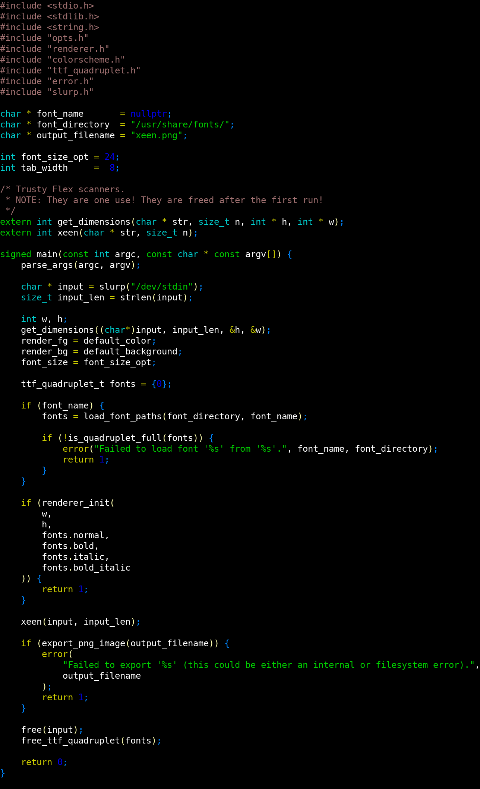

# Xeen
> pseudo terminal renderer

Xeen renders its input into a PNG as if it was a terminal.
It understands what formatting related ANSI escape codes are.

## Usage
The intended use of Xeen is to create screenshot like pictures of code and such,
without monitor-size or shaky-hand interference.

```sh
hl source/main.c | xeen --output example.png
```
Output:


Following the UNIX philosophy however,
Xeen itself does not highlight code for you,
instead it assumes the input was intelligently annotated with ANSI escapes.

To highlight code, we recommend one of the following:
| Name      | Description          | Link  |
| :-------- | :------------------- | :---- |
| hl        | Versatile and simple | [link](https://github.com/agvxov/syntax) |
| xighlight | Most Serbian         | [link](https://bis64wqhh3louusbd45iyj76kmn4rzw5ysawyan5bkxwyzihj67c5lid.onion/~xolatile/xolatilization) (onion) |
| nvcat     | Customizable         | [link](https://github.com/brianhuster/nvcat) |
| bat       | Plug-n-play          | [bat](https://github.com/sharkdp/bat) |

CLI:
```
xeen [options]
	-h --help           : print help and exit
	-v --version        : print version and exit
	-o --ouput <file>   : specify output
	-t --tab-size  <n>  : set tab width
	-s --font-size <n>  : set font size
	-f --font <file>    : set font
	-F --font-dir <dir> : set font directory
```

## Compilation
Dependencies:
* C23
* Flex
* FreeType2 (optional)

Xeen supports 2 backends: STB and FreeType2.
STB will always compile (fallback),
FreeType2 requires the corresponding library installation (used if available).
The preferred backend can be configured during build time,
by setting the `RENDERER` environment variable to one of `stb` or `freetype`.
